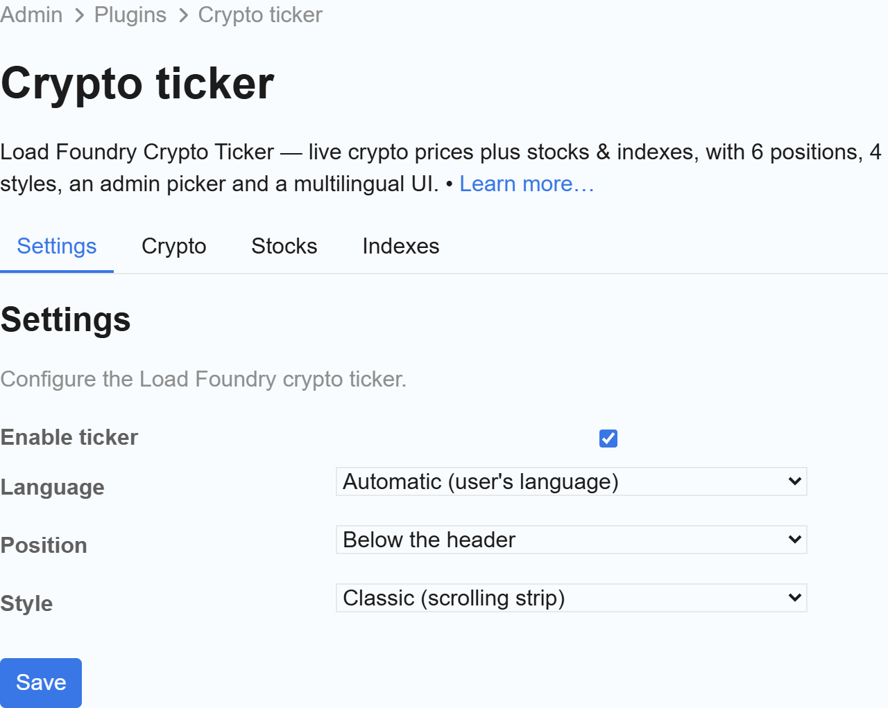
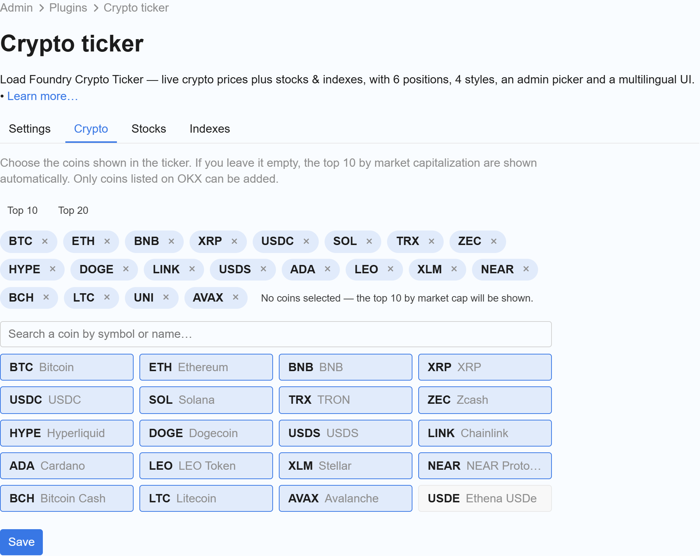
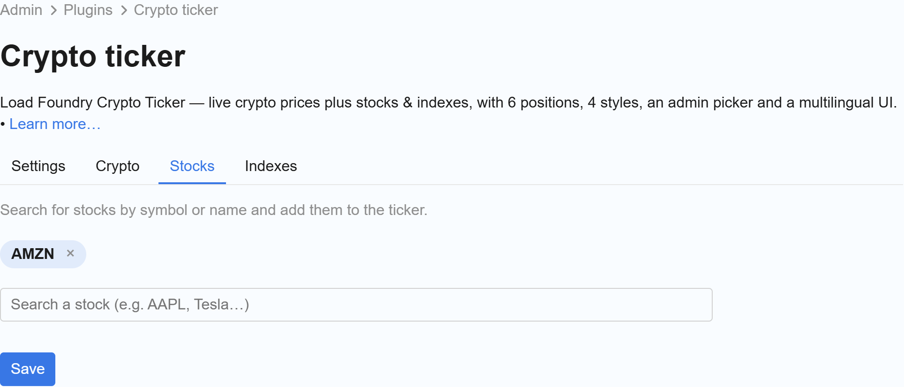
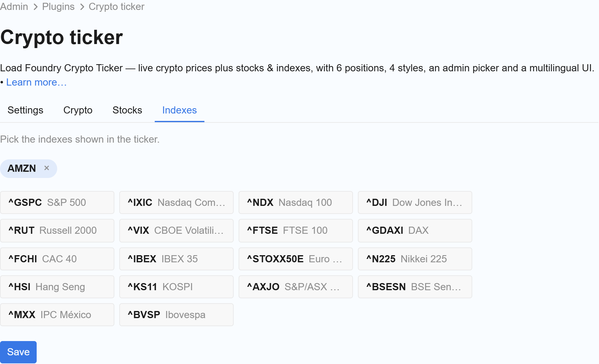

# Load Foundry Crypto Ticker

A **Load Foundry** plugin for Discourse that adds a **cryptocurrency price ticker** with live prices and 24h change.

- **Live prices + 24h change** for the coins you choose (public CoinGecko API, no API key needed).
- **6 positions**: below the header, above/below the topic list, top/end of a topic, or the left sidebar.
- **4 styles**: Classic and Dark (scrolling strips), Minimal (flat, wraps) and Cards (static grid).
- **Stocks & indexes**: show stock and index prices (Yahoo Finance) next to crypto.
- **Admin UI with independent tabs**: Settings · Coins · Stocks · Indexes.
- **Multilingual UI**: English / Español / Português, with a language selector.
- **Coins**: quick-select **Top 10** / **Top 20**, or search by symbol or name.
- Fully responsive; scrolling styles pause on hover.

## Screenshots










## Installation

Add to your `containers/app.yml` (inside `hooks: after_code:`):

```yaml
hooks:
  after_code:
    - exec:
        cd: $home/plugins
        cmd:
          - git clone https://github.com/LoadFoundryHQ/discourse-crypto-ticker.git
```

Then rebuild:

```bash
cd /var/discourse
./launcher rebuild app
```

If you already had it installed from the old URL, it keeps working (GitHub redirect).

## Admin

Open **Admin → Plugins → Load Foundry Crypto Ticker**:

- **Settings** — enable the ticker, position, style and language.
- **Coins** — pick the coins shown (quick-select **Top 10** / **Top 20**, or search). Leave it empty to show the top coins by market cap.
- **Stocks** — search and add stocks by symbol or name.
- **Indexes** — pick indexes from a curated list.

## Settings

Most options are managed from the plugin's **Settings** tab. Advanced/hidden settings
(`crypto_ticker_coins`, `crypto_ticker_stocks`, affiliate URLs, etc.) are not shown.

| Setting | Default | Description |
|---|---|---|
| `crypto_ticker_enabled` | `true` | Enable/disable the ticker. |
| `crypto_ticker_position` | `below-site-header` | Where the ticker is rendered. |
| `crypto_ticker_style` | `classic` | Visual style. |
| `crypto_ticker_language` | `auto` | Plugin UI language (`auto`/`en`/`es`/`pt`). |

> Setting keys keep the `crypto_ticker_*` prefix on purpose, so existing forums preserve their configuration after the rebrand.

### Positions

`below-site-header`, `discovery-list-container-top`, `topic-list-bottom`,
`topic-above-post-stream`, `post-stream-bottom`, `before-sidebar-sections`.

### Styles

`classic`, `dark` (both scrolling) · `minimal`, `cards` (both static).

## Notes

- Crypto prices are fetched **client-side** from the public CoinGecko API and refreshed every 60 s.
  Stocks and indexes use a **server-side Yahoo Finance** proxy.

## License

MIT — see [LICENSE](LICENSE). © Load Foundry.
