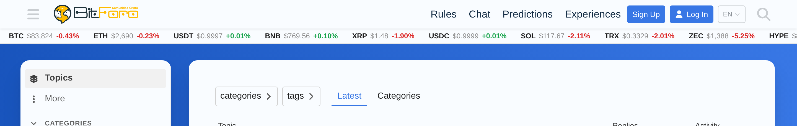
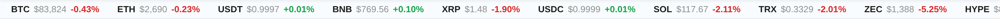
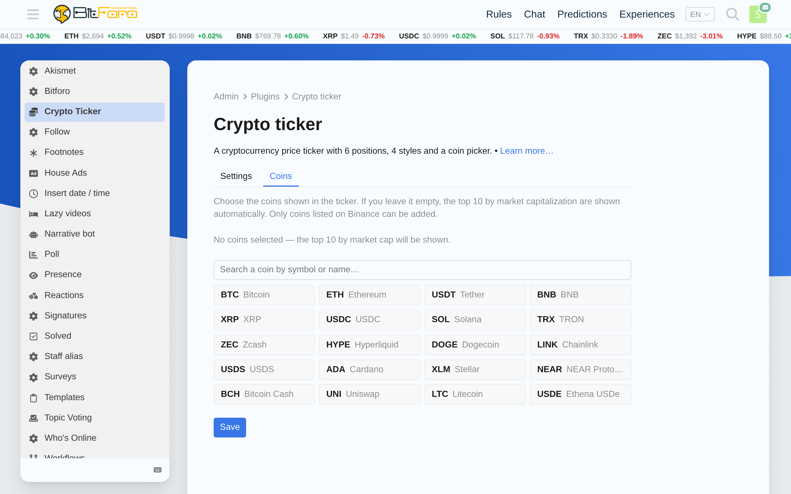

# Load Foundry Crypto Ticker

A **Load Foundry** plugin for Discourse that adds a **cryptocurrency price ticker** with live prices and 24h change.

- 💰 Live prices + 24h change for the coins you choose.
- 📍 **6 positions**: below the header, above/below the topic list, top/end of a topic, or the left sidebar.
- 🎨 **4 styles**: Classic and Dark (scrolling strips), Minimal (flat, wraps) and Cards (static grid).
- 🧩 **Coin picker**: an admin page with the top 20 coins and a live search of Binance-listed coins.
- 🔗 Every coin links to **Binance**.
- 🆓 Prices from the public **CoinGecko** API — no API key required.
- 📱 Fully responsive; scrolling styles pause on hover.

> Formerly `bitforo/discourse-crypto-ticker`. The repository moved to **Load Foundry**; the old URL redirects, so existing installs keep working.

## Screenshots







## Installation

Add to your `containers/app.yml` (inside `hooks: after_code:`):

```yaml
hooks:
  after_code:
    - exec:
        cd: $home/plugins
        cmd:
          - git clone https://github.com/LoadFoundryHQ/discourse-crypto-ticker.git
```

Then rebuild:

```bash
cd /var/discourse
./launcher rebuild app
```

If you already had it installed from the old URL, it keeps working (GitHub redirect). To point to the new home explicitly, update the clone URL.

## Choosing coins

Open **Admin → Plugins → Load Foundry Crypto Ticker** (or `/admin/plugins/crypto-ticker`) and go to the
**Coins** tab: pick from the top 20 by market cap, or search any Binance-listed coin by
symbol or name. Click **Save**.

Leave the selection empty to automatically show the top coins by market cap.

## Settings

Admin → Settings → Plugins (area **Load Foundry Crypto Ticker**):

| Setting | Default | Description |
|---|---|---|
| `crypto_ticker_enabled` | `true` | Enable/disable the ticker. |
| `crypto_ticker_position` | `below-site-header` | Where the ticker is rendered. |
| `crypto_ticker_style` | `classic` | Visual style. |
| `crypto_ticker_top_count` | `10` | How many top coins to show when no coins are selected. |
| `crypto_ticker_show_change` | `true` | Show the 24h percentage change. |

`crypto_ticker_coins` (the selected CoinGecko ids) is **hidden** from Settings because it is
managed from the coin picker page.

> Setting keys keep the `crypto_ticker_*` prefix on purpose, so existing forums preserve their configuration after the rebrand.

### Positions

`below-site-header`, `discovery-list-container-top`, `topic-list-bottom`,
`topic-above-post-stream`, `post-stream-bottom`, `before-sidebar-sections`.

### Styles

`classic`, `dark` (both scrolling) · `minimal`, `cards` (both static).

## Notes

- Prices are fetched **client-side** from the public CoinGecko API and refreshed every 60 s.
  For high-traffic forums, consider moving the fetch server-side to avoid CoinGecko rate limits.
- Every coin links to its **Binance** page.

## License

MIT — see [LICENSE](LICENSE). Based on the original work by **BitForo**; rebranded and maintained by **Load Foundry**.
